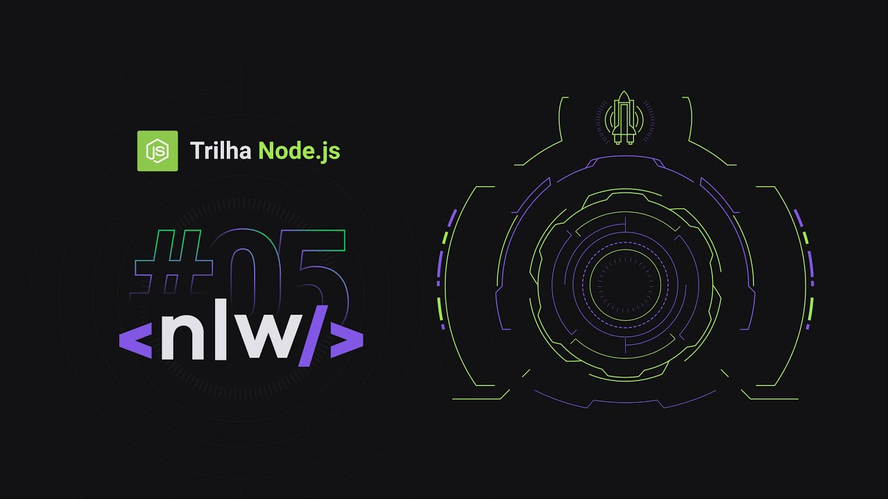

<h1 align="center">
  
</h1>

<h4 align="center">🚀 Next Level Week 5 (NLW5) - Node.js</h4>

<p align="center">
  

  
  
  <a href="https://github.com/johny83br/nlw5-nodejs/commits/master">
    
  </a>

  

  

</p>

## Sobre o Projeto

Projeto de chat via WebSocket realizado durante o NLW5 da <a href="https://rocketseat.com.br/">Rocketseat</a>. Em que o cliente abre um chamado com o atendente, e espera que o atendente o responda.

### Pré-requisitos

Antes de começar, você vai precisar ter instalado em sua máquina as seguintes ferramentas:
[Git](https://git-scm.com), [Node.js](https://nodejs.org/en/). 
Além disto é bom ter um editor para trabalhar com o código como [VSCode](https://code.visualstudio.com/)

### Rodando o Back End (servidor)

```bash
# Clone este repositório
$ git clone <https://github.com/johny83br/nlw5-nodejs>

# Acesse a pasta do projeto no terminal/cmd
$ cd nlw5-nodejs

# Instale o yarn
$ yarn install

# Execute a aplicação em modo de desenvolvimento
$ yarn dev

# O servidor inciará na porta:3333 - acesse <http://localhost:3333>
```

### Tecnologias

As seguintes ferramentas foram usadas na construção do projeto:

- [Node.js](https://nodejs.org/en/)
- [TypeScript](https://www.typescriptlang.org/)
- [Yarn](https://yarnpkg.com/)
- [socket.io](https://socket.io/)
- [TypeORM](https://typeorm.io/)